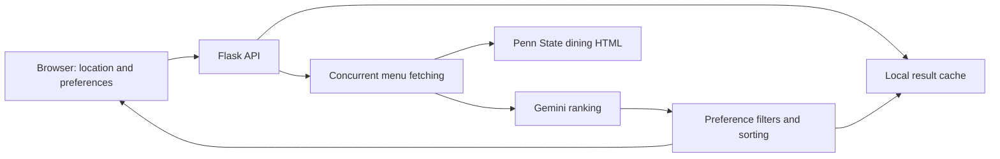

# PSU Menu Analyzer

A Flask web application that turns Penn State dining menus into meal-by-meal recommendations. Students choose a dining location and dietary preferences; the app fetches the menu, asks Gemini to rank options, and links each recommendation to the dining site's nutrition information.

[Project site](https://www.psumenu.com) · [Run locally](#run-locally) · [API](#api) · [Original CLI project](https://github.com/Arnavsharma2/PSU-Menu-Analyzer)

## What it does

- Supports 16 configured Penn State dining locations, with breakfast, lunch, and dinner results.
- Offers vegetarian, vegan, beef/pork exclusion, and protein-priority preferences.
- Fetches the three meal pages concurrently with a bounded thread pool.
- Returns ranked choices with a 0–100 model-generated score, explanation, and nutrition link.
- Reuses file-cached results keyed by campus, menu-day key, and preferences to reduce repeated API calls.
- Saves browser preferences in `localStorage` and presents results in a responsive HTML/JavaScript interface.

## How it works



The backend uses BeautifulSoup to extract menu names and nutrition links, requests structured JSON from Gemini, applies name-based preference filters, and sorts recommendations by score. Transient model API failures use bounded retries with exponential backoff.

## Run locally

Requirements: Python 3.11+, a Gemini API key with access to the model configured in `main.py`, and network access to Penn State dining pages.

```bash
git clone https://github.com/Arnavsharma2/PSUMenuAnalyzerWebsite.git
cd PSUMenuAnalyzerWebsite
python3 -m venv .venv
source .venv/bin/activate
python -m pip install -r requirements.txt

# Supply your key in the shell; keep it out of source control.
export GEMINI_API_KEY='your-key'
gunicorn --bind 127.0.0.1:5001 --timeout 180 main:app
```

Optional: set `CACHE_ADMIN_PASSWORD` in the server environment to enable authenticated cache clearing. The endpoint is disabled when this value is unset. Ordinary menu analysis does not require this setting.

Open [localhost:5001](http://localhost:5001), choose a dining location, set preferences, and select **Analyze Today's Menu**. The health endpoint can be checked without requesting menu analysis:

```bash
curl http://localhost:5001/health
```

The model endpoint is currently configured as `gemini-3.1-flash-preview` in `main.py`; model availability and account access are external dependencies.

### Docker

The included Dockerfile runs the Flask app with Gunicorn on port 8080:

```bash
docker build -t psu-menu-analyzer .
docker run --rm -p 127.0.0.1:8080:8080 \
  -e GEMINI_API_KEY psu-menu-analyzer
```

Open [localhost:8080](http://localhost:8080). The default container cache is ephemeral.

## API

| Endpoint | Purpose |
| --- | --- |
| `GET /` | Serve the web interface |
| `GET /health` | Return application status and timestamp |
| `POST /api/analyze` | Analyze the selected campus menu with dietary preferences |

The analysis request accepts `campus`, `vegetarian`, `vegan`, `exclude_beef`, `exclude_pork`, and `prioritize_protein`. Selecting both vegan and vegetarian is rejected. Results are grouped by meal, with each item represented as `[food_name, score, reasoning, nutrition_url]`.

## Implementation and limitations

- **Backend:** Flask, Flask-CORS, Requests, BeautifulSoup, Python-dotenv, and Gunicorn. The dependency file also includes aiohttp.
- **Frontend:** HTML, JavaScript, and Tailwind CSS loaded from a CDN.
- **Cache:** pickle files under `cache/`, addressed by MD5 hashes of the request's campus, day key, and preferences. This is a local application cache rather than shared storage across replicas.
- **Menu freshness:** the scraper depends on Penn State's HTML structure and available menu dates. Missing dates or weekend data can produce incomplete results or a fallback to the first available menu date.
- **Recommendation scope:** scores and explanations are model estimates based on item names, not measured nutritional values. Name-based dietary filters cannot establish ingredient or allergen safety; consult the linked dining information.
- **Validation:** `python -m unittest discover -s tests -v` covers cache-admin authentication and cache preservation. Scraping and recommendation quality do not yet have automated regression coverage.

## Repository map

| File | Purpose |
| --- | --- |
| [`main.py`](main.py) | Flask routes, scraping, Gemini requests, filtering, and caching |
| [`index.html`](index.html) | Responsive interface and saved preferences |
| [`sw.js`](sw.js) | Service-worker source |
| [`requirements.txt`](requirements.txt) | Python dependencies |
| [`Dockerfile`](Dockerfile) | Gunicorn container image |

The earlier [PSU-Menu-Analyzer](https://github.com/Arnavsharma2/PSU-Menu-Analyzer) repository contains an interactive Python CLI focused on Altoona. This repository contains the web application and multi-location interface.
